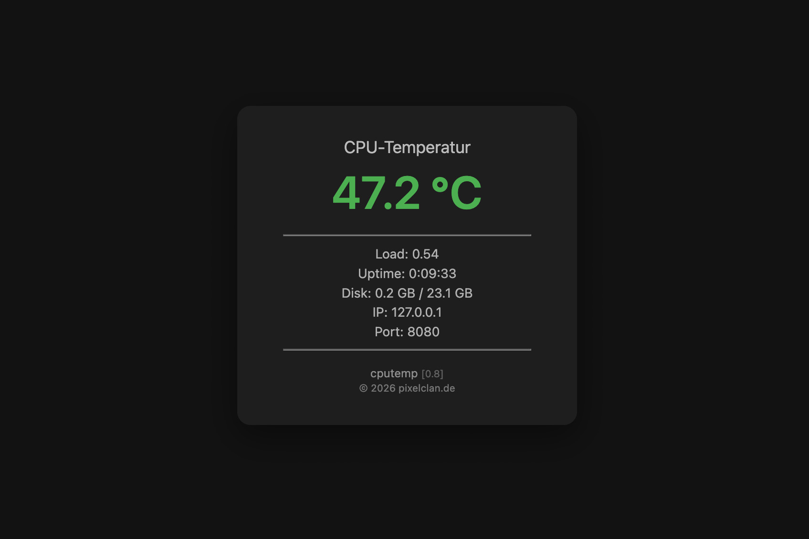

A lightweight HTTP server for displaying the CPU temperature on a Raspberry Pi.
This and more is displayed via a web interface using AJAX.

----------------

Starting the server:
- python3 server.py

Change default settings:
- nano config.py

Open the web interface: 
- For example: http://192.168.0.123:8080

----------------
(c) 2026 pixelclan.de
